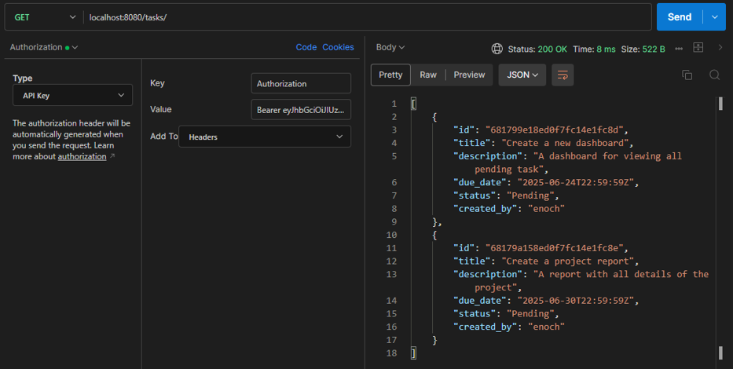

# Task Manager Functionalities
In the directory in the command line terminal, enter;

```shell
go run .
```

Visit at;
```web
localhost:8080/tasks
```

## Post A New Task


## Get All Tasks


## Get A Specific Task


## Delete A Task


### Confirm


## Updating a Task


### Confirm


## Postman Documentation
View the Postman documentation via the link below;  
https://documenter.getpostman.com/view/43924120/2sB2j1gC5i