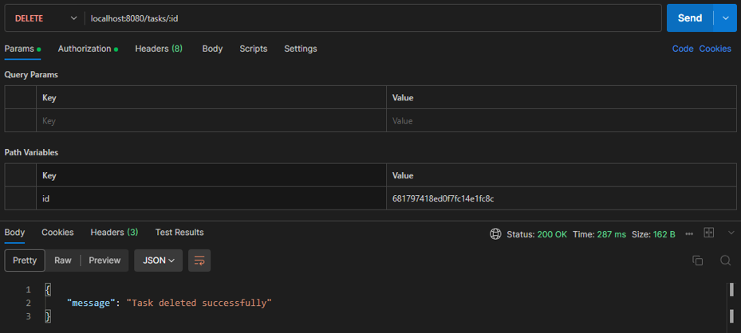

# Task Manager Functionalities
In the directory path in the command line terminal, enter;

```shell
go run .
```

Visit at;
```web
localhost:8080/tasks
```

## Create New User


## Trying To Create A New User Using an Existing Username


## Login


## Posting A New Task Without Logging In


## Post A New Task!


## Trying To Get A Task Without Logging In


## Get A Specific Task


## Trying To Get All Tasks Without Logging In


## Get All Tasks


## Trying To Update A Task Without Logging In


## Updating a Task


### Confirm


## Delete A Task


### Confirm


## Postman Documentation
View the Postman documentation via the link below;  
[https://documenter.getpostman.com/view/43924120/2sB2j1gC5i](https://documenter.getpostman.com/view/43924120/2sB2j6AWJE)